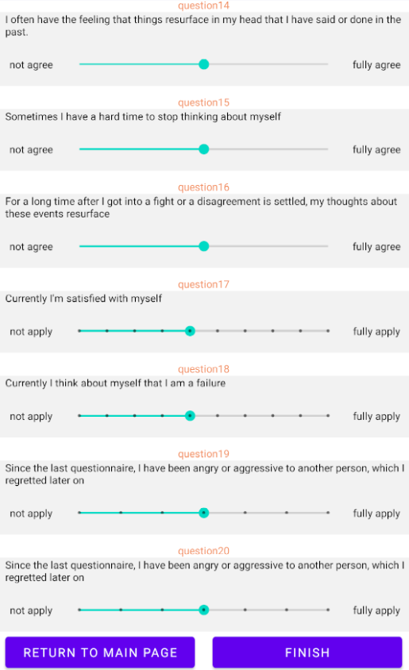

# Fit Mood - A Healthy Tracking App

## Overview

Fit Mood is a healthy lifestyle app designed to help users stay active and improve their mood through various sports and activities. The app provides a range of features, including a mood questionnaire, sports recording, DIY sports goals setting, sport archive display, GPS and sensor data collection, and notifications setting.

## How to Use Fit Mood

### 1. Mood Questionnaire

- Upon launching the app, users can fill out a mood questionnaire to assess their current mood.
- If the mood score is low, Fit Mood may suggest a random sport or activity to help uplift the user's mood.
- 
- 
- 
- 

### 2. Sports Recording

- To record different kinds of sports and activities, navigate to the "Sports Tracking" section in the app.
- Select the type of sport from the provided options (e.g., jogging, yoga, etc.).
- Tap on the "START" button to start a sport activity.
- Save the entry to database and keep track of your sports history(you can find this in archive section).
  
  

### 3. DIY Sports Goals

- users can set their own sports and fitness goals.
- Select the type of sport from the provided options (e.g., jogging, yoga, etc.) and create a new goal.
- Save the goal to track your progress and stay motivated.

### 4. Sport Archive

- The "Sport Archive" section displays a list of all the recorded sports and activities in chronological order.
- Users can view their activity history and see details such as date, sport type, duration and mood.
- Additionally, a chart may visualize the duration of sports over time.
  

### 5. GPS and Sensor Data Collection

- Fit Mood can collect GPS and sensor data during sports activities (e.g., running) to track your pace, and other metrics.
- Ensure that the GPS and sensor permissions are granted for accurate data collection.

### 6. Notifications Setting

- Users can set notifications for reminders .
- Navigate to the "Setting" section to manage notification settings.
- Adjust the time and frequency of notifications according to your preferences.

## Conclusion

Fit Mood is your all-in-one companion to stay active, track your sports, and improve your mood. Start using Fit Mood today and experience the positive impact it can have on your well-being!